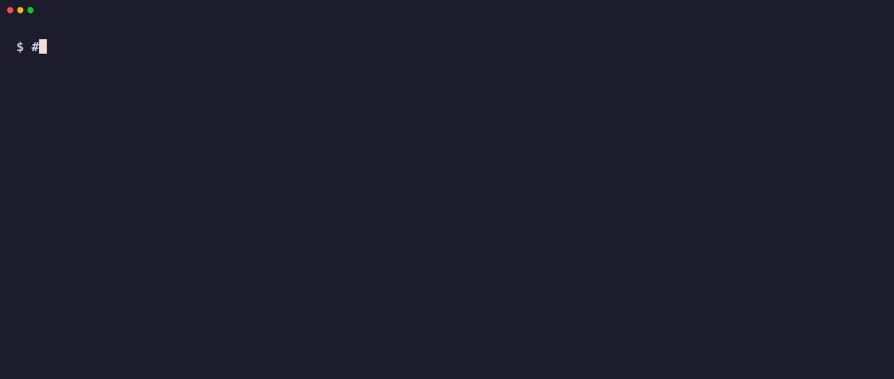
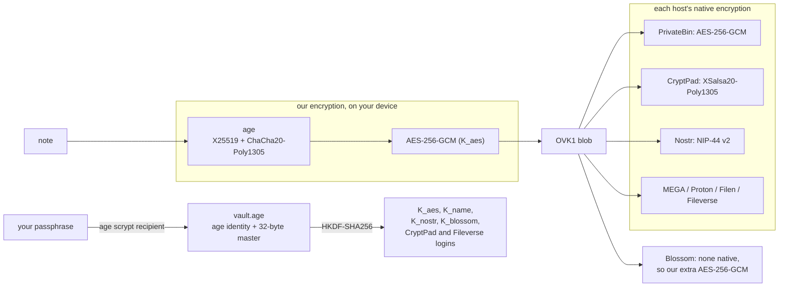

# Super Secret Notes by GaussRun

**A note you cannot afford to lose, saved in many independent places, recoverable anywhere with
a vault name plus passphrase.**

Super Secret Notes is an open-source way to **store a secret note redundantly**. Every note is
copied to a dozen independent free hosts run by different people in different places, with
**no signup** and no account: **PrivateBin, Nostr, Blossom, CryptPad** (plus opt-in MEGA,
Proton Drive, Filen and Fileverse). If some of them disappear, the others still have it, and
`check` and `repair` tell you and fix it. Lose your laptop and you **recover with a vault name
and passphrase** alone, on any machine. Before anything leaves your device, the note is
**double-encrypted** with our encryption (age, then AES-256-GCM, both on your device), and then
each host applies its native encryption on top. It comes
as a **static web app plus CLI** (the `super-secret-notes` command) that read and write the
same format, and the web app can hand a vault from a **public computer to phone via QR** code.



Web app: https://gaussrun.github.io/super-secret-notes/ (see [Web app](#web-app)).
Source: https://github.com/GaussRun/super-secret-notes

## What it does

- **Copies every note to many independent places, no signups:** out of the box to 12
  zero-signup hosts: 3 PrivateBin instances, 2 CryptPad instances (accounts created for you,
  derived from your vault), 4 Nostr relays and 3 Blossom servers, each run by a different
  operator. MEGA, Proton Drive, Filen and Fileverse are opt-in.
- **Encrypts every note twice** on your machine before it leaves: age first, then AES-256-GCM,
  with keys that only exist inside a passphrase-protected `vault.age`. Each copy then gets
  that host's native encryption on top (see [How the encryption works](#how-the-encryption-works)).
- **Reads from whichever copy is healthy:** `get` takes the first copy that passes every check
  and quietly falls back to the next one if a copy is missing, damaged or out of date.
- **Keeps score and heals itself:** `check` verifies every copy, `status` shows the health
  ledger offline, `repair` re-uploads broken copies and swaps out hosts that have died, and
  `hosts refresh` finds new volunteer hosts in public directories.
- **Runs in a browser tab too:** a static web app with no server behind it opens the same
  vaults as the CLI.
- **Comes back from nothing:** on a new machine, the vault name plus the passphrase are enough
  (`super-secret-notes recover --name`), stored logins included. The printed recovery kit is the second
  way back (`super-secret-notes recover --kit`).

## Install

Written in: Node.js 24, plain ESM JavaScript for the CLI, SvelteKit (static adapter) for the
web app. npm package name: `super-secret-notes` (not published on npm yet, so install from
source as below).

Needs Node 24 or newer and pnpm.

```sh
git clone https://github.com/GaussRun/super-secret-notes.git
# or over SSH: git clone git@github.com:GaussRun/super-secret-notes.git
cd super-secret-notes/overkill/cli
pnpm install --frozen-lockfile
```

Then put `super-secret-notes` on your PATH, one of two ways:

```sh
# a) as a global pnpm command that points at this checkout (run `pnpm setup` once first
#    if pnpm has never installed a global command on this machine)
pnpm add --global "link:$PWD"

# b) or an alias in your shell startup file (~/.zshrc or ~/.bashrc); it looks up the
#    entry file in package.json, so run it from overkill/cli
echo "alias super-secret-notes='node $PWD/$(node -p "require('./package.json').bin['super-secret-notes']")'" >> ~/.zshrc
```

Open a new shell and check:

```sh
super-secret-notes --version
super-secret-notes --help
```

The Fileverse backend's official library is an optional dependency of about 175 MB;
`pnpm install --frozen-lockfile --no-optional` skips it if you will not use Fileverse.

State lives in `$OVERKILL_HOME` (default `~/.overkill-notes`), every file mode 0600. The
project was called Overkill Notes while it was built, so the environment variables keep the
`OVERKILL_` prefix and the state directory keeps its old name.

## 60-second quickstart

```sh
echo "Spare house key: with the neighbours at number 12." | super-secret-notes put spare-key
```

On a machine with no vault, the first `put` sets one up: it asks for a vault name, shows you a
generated 6-word passphrase (**write it down**), provisions the 12 zero-signup hosts, uploads,
and prints the recovery kit (print that too). Then:

```sh
super-secret-notes put recovery-codes ./recovery-codes.txt  # from a file instead of stdin
super-secret-notes get recovery-codes                       # to stdout, or: super-secret-notes get recovery-codes -o codes.txt
super-secret-notes ls                                       # note names, from the merged index
super-secret-notes check                                    # download EVERY copy from every host and verify it (-v: list them all)
super-secret-notes status                                   # offline: the health ledger (last verified, next expiry, warnings)
super-secret-notes repair                                   # re-upload missing, corrupt or stale copies; swap dead hosts
super-secret-notes refresh                                  # re-upload copies that are gone or expire soon (cron it)
super-secret-notes kit                                      # print the recovery kit again

# a different machine, a lost laptop, a fresh start:
super-secret-notes recover --name <vault name>              # asks for the passphrase, rebuilds everything
```

To see the redundancy at work, `super-secret-notes chaos <backend> spare-key` flips one byte in
one host's copy: `check` catches it (`CORRUPT (aes layer)`), `get` reads another copy, and
`repair` replaces the damaged one.

### The health ledger

Every copy has one of five states: `OK`, `MISSING`, `CORRUPT` (a tag or MAC failed; the layer
is named), `STALE` (decrypts fine but is an older version) or `ERROR` (the host could not be
reached). Results go into a health ledger inside the encrypted index: `check` refreshes all of
it, and every `put` spot-checks 3 other copies (or 10 seconds, whichever comes first), least
recently verified first (`--no-sample` skips that). `super-secret-notes status` reads the ledger with no
network at all and warns about copies not verified in 30 days (`STALE CHECK`), notes with fewer
than 2 healthy copies (`AT RISK`) and hosts that keep failing (`FLAKY`).

### Other setups

```sh
super-secret-notes init                      # just make the vault on the 12 defaults (no note yet)
super-secret-notes init --advanced           # pick hosts yourself, one type at a time (details below)
super-secret-notes init --from config.json   # non-interactive, for scripts
super-secret-notes init --index-sync manual  # keep the index on this machine until `super-secret-notes sync`
```

`init --advanced` walks through every backend type and asks whether you want it: the
zero-signup ones too (keep PrivateBin and Nostr but skip CryptPad, say), plus MEGA, Proton
Drive, Filen, Fileverse, rclone and local folders. Like the plain `init`, it asks for a vault
name first; with the passphrase, that name is all `recover --name` needs later.

For scripts and cron, the passphrase can come from `OVERKILL_PASSPHRASE` or
`OVERKILL_PASSPHRASE_FILE` (first line of a 0600 file). Logs go to stderr;
`OVERKILL_LOG=debug` for more.

## Web app

The web app runs at https://gaussrun.github.io/super-secret-notes/. The code is in
`overkill/web`, and its tests run in this repository.

The web app is a **static site**: HTML and JavaScript, no server of ours, no accounts. The page
talks straight to PrivateBin instances, Nostr relays, Blossom servers and CryptPad, and runs the
CLI's own modules for encryption, replication, the index and recovery, so a vault made in one
opens in the other. Every view has its own URL (`/notes/`, `/check/`, `/status/`, `/hosts/`,
`/recover/`, `/trust/` and so on).

**Trust model.** Your passphrase, the vault keys and your notes in plaintext live only in the
tab's memory; a reload forgets them. The browser stores only encrypted files (`vault.age`, the
config, an index copy, `secrets.ovk`). A strict Content-Security-Policy allows scripts only from
the site itself, no third-party scripts, CDNs, fonts or analytics, and no referrer. What you
still have to trust is **whoever serves the page**: a changed page could send your passphrase
anywhere, and you would not notice. That is true of every web app. For anything that matters,
build it yourself (`pnpm build` in `overkill/web`) and serve it from a machine you control, or
use the CLI. The app's `/trust/` page says the same.

**Password managers.** The vault name is the username and the passphrase is the password. Setup,
unlock and recover are real forms with the right `autocomplete` hints, so the browser's own
manager, 1Password, Bitwarden and friends can save and fill them; the forms submit nothing
anywhere and never put the passphrase in the URL. Keep the recovery kit anyway.

**Public computer mode.** A switch on setup, recover and unlock (off by default): the vault
lives in the tab's memory only, nothing is written to browser storage, and the password manager
is not asked to save anything. "Done: wipe this tab" forgets everything and clears this
browser's stored copy of the vault too. The start page has a one-click throwaway vault for this.

**Send to phone (QR).** On the recovery kit page and the notes page, "Show QR" displays a QR code
generated inside the page: either a recovery link that carries the vault name and passphrase in
the URL fragment (the part after `#`, which browsers never send to a server; the page removes it
from the address bar and asks before recovering), or plain text for a password manager. The QR
comes with a large warning and hides itself after 60 seconds. A public computer may have a
keylogger or record the screen, so use a throwaway vault for one-off transfers and change
anything important afterwards; open the link in a private tab on the phone where you can.

Run it locally (Node 24, pnpm; the build imports `../cli/src`, so keep the repository layout):

```sh
cd super-secret-notes/overkill/web
pnpm install --frozen-lockfile
pnpm dev    # http://localhost:5173
pnpm build  # static site in build/, for any static file server
```

Details on deploying, the Content-Security-Policy and the browser CORS checks per host are in
`overkill/web/README.md`.

## Backends

Every host counts as its own operator, and redundancy comes from different operators, not from
several accounts at one provider (`init` warns if two backends share one).

| Backend | Default? | What you need | Native encryption (on top of ours) | Retention | Holds the index? |
|---|---|---|---|---|---|
| PrivateBin (`privatebin`) | yes, 3 | nothing | PrivateBin's AES-256-GCM, random key per paste (the key is the URL `#fragment`, kept in `secrets.ovk` and the encrypted index) | never, host-confirmed (the stored paste has no expiry); volunteer-run, so instances do disappear | no |
| CryptPad, derived account (`cryptpad`) | yes, 2 | nothing: username and password are derived from your vault, one account per instance | CryptPad's own end-to-end encryption, through CryptPad's client modules | while the account is active (instance policy; varies per instance) | yes |
| Nostr relays (`nostr`) | yes, 4. **Experimental** | nothing: the key is derived from your vault | NIP-44 v2 encryption to a vault-derived key | none promised; we republish on our own schedule (assumed 120 days) | yes |
| Blossom servers (`blossom`) | yes, 3. **Experimental** | nothing: uploads are signed with a vault-derived key | none native, so our extra AES-256-GCM under a vault-derived key; the blob's sha256 is checked before decrypting | none promised; we republish on our own schedule (assumed 120 days) | no |
| MEGA (`mega`) | opt-in | an account (email and password) | MEGA's end-to-end encryption | while the account exists (20 GB free) | yes |
| Proton Drive (`proton-cli`) | opt-in | an account plus Proton's official `proton-drive` CLI, logged in once | Proton's end-to-end encryption | while the account exists; old versions kept as revisions | yes |
| Filen (`filen`) | opt-in | an account (email and password, no 2FA yet) | Filen's end-to-end encryption | while the account exists (10 GB free, Germany) | yes |
| Fileverse dDocs (`fileverse`) | opt-in | by default nothing: the vault derives a wallet and creates its own account, and the official library runs inside the CLI (no daemon). Alternatively, an API key from their web app. See the terms note below | AES-256-GCM per save, key locked with ECIES; stored on IPFS, recorded on Gnosis | while the account exists (on IPFS, as long as the pins last) | yes |
| CryptPad, your own account (`cryptpad`) | opt-in. **Experimental** | origin, username and password (no 2FA) | CryptPad's end-to-end encryption | while the account is active (instance policy; varies per instance) | yes |
| rclone (`rclone`) | opt-in | an rclone remote you configured | whatever the remote does; point it only at end-to-end encrypted providers | depends on the remote | yes |
| Local folder (`local`) | opt-in | a path (USB stick, NAS) | none | as long as the stick survives | yes |

The house rule for hosted backends: the host adds its own encryption layer, and data is kept at
least a year. Nostr and Blossom meet the second half only by observation, not by promise,
which is why they are marked experimental and why `refresh` exists. CryptPad keeps data while
the account is active, and what counts as inactive is each instance's own policy (some have no
limit, others 90 days), so run `check` regularly and let `repair` replace copies that are gone.
Keep at least one backend
that meets the rule on its own. The full reasoning, relay and server probes included, is in
`docs/OVERKILL.md`, `overkill/cli/docs/NOSTR.md` and `overkill/cli/docs/HOSTS.md`.

### Where the index lives

The index is the encrypted list of your notes, where their copies sit, and the health ledger.
It lives only on backends with stable paths (CryptPad, Nostr, MEGA, Proton, Filen, Fileverse,
rclone, local folders), never on PrivateBin or Blossom, which pick their own addresses. A
config needs at least one index holder, and `init` warns below two. With the 12 defaults that
is 6 of them.

The `index_sync` setting decides when it leaves this machine:

- `always` (default): every change goes to the index holders.
- `manual`: the index stays in this machine's encrypted local copy until `super-secret-notes sync`.
- `never`: the index stays here for good (`super-secret-notes sync --force` pushes it anyway).

Change it with `super-secret-notes config set index_sync manual` (or `init --index-sync <mode>`). With
`manual` or `never`, a recovery elsewhere sees your notes as of the last sync; later ones are
still found by their exact name (`super-secret-notes get <name>`), because blob names come from note
names. `super-secret-notes index export` writes the index out, encrypted by default;
`--plaintext --yes-reveal-note-names` writes plain JSON, which shows your note names and the
PrivateBin and Blossom locators with their keys.

### Host discovery and self-healing

Volunteer hosts come and go. `super-secret-notes hosts refresh` reads a few public directories baked into
the code (the PrivateBin directory, cryptpad.org/instances, NIP-66 relay monitors, Blossom
server announcements), then probes new candidates one at a time with a small throwaway test
object that it deletes again. Results go to `hosts.json` next to your vault state.

```sh
super-secret-notes hosts refresh --cap 5         # probe at most 5 new candidates per type
super-secret-notes hosts refresh --type nostr    # just relays
super-secret-notes hosts list --type privatebin  # what is known: status, last probe, source directory
super-secret-notes hosts add privatebin <url>    # add one by hand (probed right away unless --no-probe)
super-secret-notes hosts remove cryptpad <url>   # never use this host again (built-in ones too)
```

New vaults then prefer healthy hosts. `repair` swaps a backend that has served no good copy for
7 days for a healthy host of the same type, re-uploads your copies there, and republishes the
recovery record; `repair --no-swap` only prints a suggestion. The CLI does not read terms of
service: **following each host's terms is your responsibility.** Where we know something
relevant, `hosts list` prints it as an `info:` line (a few CryptPad instances forbid automated
account creation); `hosts remove` keeps a host out.

### Credentials: `secrets.ovk`

Passwords, API keys, sessions (MEGA and Filen sessions hold account keys) and the PrivateBin and
Blossom locators are stored in `secrets.ovk`, encrypted with the vault keys, never in plain
text in `config.json`. Older plaintext configs and session files are moved in on the first run
(the old files are overwritten with a stub; the CLI deletes nothing). Prefer to keep a secret
outside the vault? `{"env": "VAR"}` and `{"envFile": "/path/.env", "key": "VAR"}` still work.
Because `secrets.ovk` travels in the encrypted recovery record, `recover --name` brings those
logins back too. Two exceptions: the Proton CLI keeps its own session in the OS keychain, and
rclone keeps its tokens in its own config.

## How the encryption works

**Our encryption, then each host's native encryption.** First our encryption: age, then
AES-256-GCM, both applied on your device before anything leaves it. Then each host's native
encryption: PrivateBin's AES-256-GCM, CryptPad's XSalsa20-Poly1305, Nostr's NIP-44. Blossom has
none, so we add an extra AES-256-GCM layer there.



The same thing in plain text:

```
passphrase ──age scrypt──> vault.age = { age X25519 identity, master (32 random bytes) }
                                              │
                                              └─HKDF-SHA256─> K_aes     (our AES-256-GCM)
                                                              K_name    (file names)
                                                              K_nostr   (Nostr key, Blossom signing)
                                                              K_blossom (extra Blossom layer)
                                                              CryptPad username + password per instance
                                                              Fileverse wallet and API key (opt-in)

note ─age─> ─AES-256-GCM(K_aes)─> "OVK1" blob ─each host's native encryption─> 12 copies
     └───── our encryption ─────┘  (on your device; Blossom gets our extra AES-256-GCM)

passphrase + vault name ──scrypt(N=2^18)──> discovery key (Nostr) ─> vault.age + recovery record
```

**Our encryption, step 1: age.** Every note is encrypted to the vault's own age X25519 identity, in age's
binary format ([age v1 specification](https://age-encryption.org/v1), implemented by the
[typage](https://github.com/FiloSottile/typage) library). A fresh file key is wrapped with an
X25519 key agreement, HKDF-SHA-256 and ChaCha20-Poly1305; the note itself is encrypted with
ChaCha20-Poly1305 in 64 KiB chunks under a key derived from that file key with HKDF-SHA-256.

**Our encryption, step 2: AES-256-GCM.** The age output is encrypted again:
`"OVK1" || nonce (12 random bytes) || AES-256-GCM(K_aes, nonce, age output, AAD = "OVK1" || blob id)`.
The AAD binds each blob to its name, so a host cannot swap two notes. All keys come from the
vault's random 32-byte master through HKDF-SHA256 with an empty salt and a distinct label
(`"overkill v1 aes"`, `"overkill v1 name"`, `"overkill v1 nostr"`, `"overkill v1 blossom"`,
`"overkill v1 cryptpad:<host>"`, `"overkill v1 fileverse"` and a few more). The code is short
and uses only WebCrypto and age: [overkill/cli/src/crypto.js](overkill/cli/src/crypto.js).

**Then each host's native encryption.**

| Host | Its native encryption (primary source) |
|---|---|
| PrivateBin | AES-256-GCM, with the key derived by PBKDF2-HMAC-SHA256 (100,000 iterations) from a random 32-byte paste key that lives only in the URL fragment ([PrivateBin encryption format](https://github.com/PrivateBin/PrivateBin/wiki/Encryption-format)). We write pastes in that format; the paste URLs, keys included, stay in our encrypted index and `secrets.ovk`. |
| CryptPad | XSalsa20-Poly1305 for document content and Ed25519 signatures ([CryptPad white paper](https://blog.cryptpad.org/images/whitepaper.pdf)), through CryptPad's own client modules. |
| Nostr relays | NIP-44 v2 to a vault-derived key: secp256k1 ECDH, HKDF-SHA256, ChaCha20, HMAC-SHA256 and length padding ([NIP-44](https://github.com/nostr-protocol/nips/blob/master/44.md)). |
| Blossom servers | None: Blossom stores the exact bytes it receives ([BUD-02](https://github.com/hzrd149/blossom/blob/master/buds/02.md)). So we add our own extra layer: `"OVKB" || nonce || AES-256-GCM(K_blossom, nonce, blob)`, with `K_blossom` from HKDF-SHA256 over the master. |
| MEGA, Proton Drive, Filen, Fileverse (opt-in) | Their client-side encryption, done by their official SDK, CLI or library ([MEGA](https://mega.io/security), [Proton Drive](https://proton.me/drive/security), [Filen](https://filen.io/), [Fileverse](https://fileverse.io/)). |

Everything the zero-signup hosts' layer uses (paste keys, NIP-44 key, Blossom key, CryptPad
logins) comes from your own vault, so this outer layer protects against a host leaking what it stores,
not against someone who has your vault.

**Keys and passphrase.** `vault.age` holds the age identity and the master, encrypted with your
passphrase through age's scrypt recipient (work factor 2^18; scrypt then ChaCha20-Poly1305).

**Names.** Hosts see `notes/<64 hex chars>.ovk`, an HMAC-SHA256 of the note name under
K_name, plus sizes and timestamps. Never the note names, never the contents.

**Integrity.** Every read checks every layer's authentication tag and the sha256 recorded in
the index. A copy that fails is reported, skipped, and later repaired.

**Discovery key.** `scrypt(passphrase, salt = "overkill v1 discovery:" + vault name, N=2^18)`,
used as a Nostr key. Under it, the relays hold a copy of `vault.age` and a small encrypted
recovery record (which hosts, which CryptPad accounts, the main Nostr key, `index_sync`, and
the encrypted `secrets.ovk`). The vault name is the salt, so there is no global
precomputation.

Format v1 is specified in [docs/OVERKILL.md](docs/OVERKILL.md), with known-answer vectors in
[overkill/cli/test/vectors.json](overkill/cli/test/vectors.json) for anyone writing a second
implementation.

## Recovery

Two ways back, and you want both:

1. **Vault name plus passphrase.** On any machine: `super-secret-notes recover --name <vault name>`. It
   derives the discovery key, fetches `vault.age` and the recovery record from the Nostr
   relays, and rebuilds this machine's setup, stored logins included: PrivateBin, CryptPad,
   Nostr and Blossom come back, and so do MEGA, Filen, your own CryptPad account and Fileverse
   when their logins are in `secrets.ovk`. Only backends whose login lives outside the vault
   (the Proton CLI, rclone, `env` references) are named for you to add again. No `repair`
   needed: run `super-secret-notes ls` and `super-secret-notes check` and carry on.
2. **The recovery kit.** `init` and `super-secret-notes kit` print a sheet with the vault name, the age
   identity and master (the first printing also shows the generated passphrase), the root
   folder, the list of hosts, the CryptPad account names, the Nostr public key and the
   PrivateBin and Blossom addresses of `vault.age`. If the relays have forgotten your recovery record, or you forgot the passphrase,
   save the sheet as text and run `super-secret-notes recover --kit kit.txt` (or `--kit -` to paste it).
   Hosts that need no login of their own come back; the others are named. It rebuilds
   `vault.age` under a **new** passphrase (strength-checked), and `super-secret-notes repair` then
   replaces the old copies on the hosts.

Lose the passphrase **and** the kit, and your notes are gone. There is no reset, no support
line, no "forgot password". That is the point.

## The fine print (read this one)

- **The passphrase IS the security.** `vault.age` sits on public paste sites and public relays,
  on purpose, so that name plus passphrase can recover everything. Anyone can download it and
  try passphrases offline. That is why `init` generates 6 random words (about 77 bits) and
  refuses a self-chosen passphrase that looks weaker (`init --from`, meant for scripts, only
  warns). Do not talk it out of that.
- **The kit is the keys.** It holds the master (and the first printing, the generated
  passphrase). Anyone who reads it reads your notes. Paper in a drawer beats a screenshot in the cloud.
- **The extra layers are depth, not the main defense.** One good layer (age) would already be
  fine. The real risks are the passphrase, the recovery kit lying around, and the laptop you type on.
  The zero-signup hosts' native encryption is applied by this client with keys from your own vault,
  so it guards against a host leaking what it stores, not against someone who has your vault.
  Several copies with several operators is the part that actually helps.
- **Volunteer hosts disappear.** Roughly 60% of the PrivateBin instances listed in 2021 are gone
  today. Relays and Blossom servers promise no retention at all. Run `super-secret-notes check` now
  and then and `super-secret-notes refresh` from cron (weekly is plenty), and let `repair` fix or swap
  what they report.
- **Metadata is visible.** Hosts see sizes, times and random-looking names. On Nostr that
  metadata is public to everyone, not just to one provider.
- **Terms of service are yours to follow.** The CLI never gets around a captcha or an anti-bot
  check, and it keeps to one CryptPad account per instance per vault, but it does not read
  terms. Fileverse is the sharpest case: its Acceptable Use Policy bans using the service for
  backing up and creating accounts outside its public interfaces, and the derived-wallet login
  does exactly what their web app does, without the web app. That is why Fileverse is opt-in
  and never a default. Read their terms and decide for yourself.
- **No deletion yet.** Format v1 cannot delete notes. Replaced copies are cleaned up where the
  host allows it, but old versions may linger on some hosts.
- **Nothing here has been audited.** Not the format, not the code. It is built from well-known
  parts, and combining well-known parts is exactly where mistakes hide. See `SECURITY.md`.

## Being a good citizen

The default hosts are run by volunteers who give storage away for free. Super Secret Notes is meant
for notes (a few kilobytes), not backups of your photo library.

- **Rate limits are built in.** PrivateBin allows one post per 10 seconds per IP and the CLI
  waits for it. Nostr publishes are spaced at least 3 seconds apart, with one polite retry after
  30 seconds on `rate-limited` (one big relay banned our IP for a while after events sent 1 s
  apart, which is how we learned). `hosts refresh` probes one host at a time, at most `--cap`
  per type, and skips hosts probed in the last 24 hours. Please do not patch those delays out.
- **One account per provider, one vault per person.** Each vault owns one derived account per
  CryptPad instance; a script that spins up hundreds of vaults spins up hundreds of accounts.
  Don't.
- **Don't abuse volunteer instances.** No large files, no tight cron loops (`refresh` only
  touches copies that need it; weekly is enough), no load testing, no `hosts refresh` with a
  huge `--cap` every hour. Blossom servers that only accept media are left out on purpose; do
  not disguise notes as images to get past them.
- **Give something back.** See [Thanks](#thanks): support the operators you rely on, or
  self-host a PrivateBin, a CryptPad or a relay and add it with `super-secret-notes hosts add`.

## Thanks

Super Secret Notes only works because people run free, open hosts for everyone, usually on
their own time and money. Thank you to the operators of the default hosts:

- **PrivateBin:** [pb.envs.net](https://pb.envs.net), [paste.systemli.org](https://paste.systemli.org),
  [extrait.facil.services](https://extrait.facil.services)
- **CryptPad:** [cryptpad.private.coffee](https://cryptpad.private.coffee),
  [crypt.unredacted.org](https://crypt.unredacted.org)
- **Nostr relays:** [nos.lol](https://nos.lol), [nostr.mom](https://nostr.mom),
  [purplerelay.com](https://purplerelay.com), [nostr.oxtr.dev](https://nostr.oxtr.dev)
- **Blossom servers:** [nostr.download](https://nostr.download), [blossom.ditto.pub](https://blossom.ditto.pub),
  [cdn.hzrd149.com](https://cdn.hzrd149.com)

and to everyone else listed in the public [PrivateBin](https://privatebin.info/directory/),
[CryptPad](https://cryptpad.org/instances/) and Nostr and Blossom directories that
`super-secret-notes hosts refresh` reads. Thanks as well to the people behind
[PrivateBin](https://privatebin.info/), [CryptPad](https://cryptpad.org/),
[Nostr](https://nostr.com/), [Blossom](https://github.com/hzrd149/blossom) and
[age](https://age-encryption.org/v1).

**If you rely on one of these hosts, please support it.** Most operators have a donation,
sponsorship or contact page on their site; a few euros a month, a thank-you note, or simply
staying within their limits all help. Running your own instance and adding it with
`super-secret-notes hosts add` helps everyone.

## License

AGPL-3.0-or-later, see `LICENSE`. The Filen SDK (`@filen/sdk`) and the vendored CryptPad
client modules are AGPL-3.0; everything else in use is under licenses compatible with it.

Third-party files in this repository, with origin, license and checksums, are listed in
`overkill/cli/THIRD_PARTY.md`: eight unmodified CryptPad client modules (AGPL-3.0-or-later,
XWiki CryptPad Team and contributors) and the EFF large diceware wordlist (CC BY 3.0 US,
Electronic Frontier Foundation).

Security issues: see `SECURITY.md`.
