# Super Secret Notes: the `super-secret-notes` CLI

Part of **Super Secret Notes by GaussRun**. The command is `super-secret-notes` (it used to be
`overkill`, which lives on in the file format labels and the environment variables).

**A note you cannot afford to lose, saved in many independent places, recoverable anywhere with
a vault name plus passphrase.**




`super-secret-notes` copies each note to many independent hosts (by default 12 that need no
signup: PrivateBin, CryptPad, Nostr relays, Blossom servers), so losing one host, or several,
loses nothing. `check` verifies every copy, `repair` re-uploads broken ones, and a vault name
plus passphrase brings everything back on a new machine. Before a note leaves your machine it is
encrypted twice (age, then AES-256-GCM), and each host adds its own layer on top (details:
[How it works](https://gaussrun.github.io/super-secret-notes/how-it-works/) and the format spec,
[docs/OVERKILL.md](../../docs/OVERKILL.md)). Reading picks the first copy that passes every check and quietly falls back to the
next one if a copy is missing, damaged, or out of date.

## The fine print, in plain words

- **Lose the passphrase and the recovery kit, and your notes are gone.** Nobody can
  reset it. Not us, not MEGA, not Proton. There is no "forgot password".
- **The double encryption is mostly for fun.** One good layer (age) would already be
  fine. The real risks are the passphrase, the recovery kit lying around, and the
  laptop you type on. Several copies in several places is the part that actually helps.
- Providers see random-looking file names (`notes/<64 hex chars>.ovk`), sizes and
  timestamps. They do not see note names or contents.
- Deleting notes is not supported yet (format v1).

## Install

Node 24 and pnpm:

```sh
cd overkill/cli && pnpm install
alias super-secret-notes="node $PWD/bin/super-secret-notes.js"
```

## Use

On a machine with no vault, the first `put` sets one up: it asks for a vault name, generates
a 6-word passphrase (write it down), stores copies on the 12 zero-signup defaults (3 PrivateBin
instances, a CryptPad account on 2 instances, created for you with credentials derived from
the vault, 4 Nostr relays and 3 Blossom servers), and prints the recovery kit. No accounts to sign up for, no config files.

```sh
echo "github: 7f3a-91c2 ..." | super-secret-notes put "recovery codes"   # first time: makes the vault, then stores the note
super-secret-notes init --advanced               # instead: pick clouds yourself (MEGA, Proton, Filen, ...)
super-secret-notes put taxes ./taxes-2026.txt
super-secret-notes ls
super-secret-notes get "recovery codes"          # to stdout, or -o file
super-secret-notes check                         # downloads EVERY copy and verifies it
super-secret-notes status                        # offline: what the health ledger says (last verified, warnings)
super-secret-notes chaos mega "recovery codes"   # flips one byte on one cloud, to see check and repair work
super-secret-notes check                         # ...and there it is: "mega CORRUPT (aes layer)"
super-secret-notes repair                        # re-uploads it from a healthy copy
super-secret-notes refresh                       # re-upload copies that are missing or expire within 90 days
super-secret-notes kit                           # print the recovery kit again
super-secret-notes hosts refresh --cap 5         # find new PrivateBin/CryptPad/Nostr/Blossom hosts in public directories
super-secret-notes hosts list --type privatebin  # what is known: status, last probe, source directory
```

`check` output looks like this (real run against MEGA, Proton Drive and a folder):

```
vault.age              mega OK, proton OK, usb OK (3/3 healthy)
index                  mega OK, proton OK, usb OK (3/3 healthy)
wifi password          mega OK, proton OK, usb OK (3/3 healthy)
recovery codes         mega CORRUPT (aes layer), proton OK, usb OK (2/3 healthy)
11/12 copies healthy. Run `super-secret-notes repair`.
```

Every `put` also spot-checks 3 other copies (or 10 seconds, whichever comes first), least
recently verified first, and writes the results into a health ledger inside the encrypted
index (`--no-sample` skips it). `super-secret-notes status` reads that ledger without any network and
warns about copies not verified for 30 days (`STALE CHECK`), notes with fewer than 2 healthy
copies (`AT RISK`) and backends that keep failing (`FLAKY`). Its Retention column says what
each host actually promises: PrivateBin "never (host-confirmed)", CryptPad "while the account
is active (instance policy)", MEGA and the other account hosts "while the account exists", and
Nostr and Blossom "none promised; republish by <date>". That date is **our policy, not the
host's promise**: we treat a relay or Blossom copy as possibly gone 120 days after it was
published, and `refresh` republishes it after 30 days.

The index (the encrypted list of your notes and where their copies are) lives on the
backends that have stable paths (CryptPad, Nostr, MEGA, ...), not on PrivateBin or Blossom.
If you would rather keep it at home: `super-secret-notes config set index_sync manual` keeps it on this
machine until `super-secret-notes sync`, and `never` keeps it here for good (recovery elsewhere then sees
only what was last synced, plus any note you ask for by its exact name).
`super-secret-notes index export` writes it out, encrypted by default.

Copy states: `OK`, `MISSING`, `CORRUPT` (a tag or MAC failed; the layer is named),
`STALE` (decrypts fine but is an older version than the index says), `ERROR` (the
backend could not be reached).

On a second device: `super-secret-notes recover --name <vault>` with the passphrase, or `super-secret-notes recover --kit
<file>` with the printed kit. (`init --advanced` or `--from` with the same backends also finds the
existing `vault.age` and joins it.)

Scripting: set `OVERKILL_PASSPHRASE` (or `OVERKILL_PASSPHRASE_FILE`, first line of a 0600 file) and use `super-secret-notes init --from config.json`.
State lives in `$OVERKILL_HOME` (default `~/.overkill-notes`), all files mode 0600.
The environment variables keep their `OVERKILL_` prefix (and the state directory its name) from
when the command was called `overkill`, so existing setups and scripts keep working.
Logging goes to stderr; `OVERKILL_LOG=debug` for more.
Credentials you give `init --advanced` (MEGA or Filen passwords, CryptPad logins, API keys) and
the sessions those services hand out are stored in `secrets.ovk`, encrypted with the vault keys,
never in `config.json`. `{"env": "VAR"}` and `{"envFile": ..., "key": ...}` references stay
available if you prefer to keep a secret outside the vault. Older plaintext configs and session
files are moved in on the first run (the old session files are overwritten with a stub, delete
them at leisure). `recover --name` restores these logins too.

`init --from` still accepts a weak passphrase (for scripts and tests), with a loud warning:
vault.age sits on public hosts, so a weak passphrase can be guessed offline. Interactive
`init`, `put` on a fresh machine and `recover --kit` refuse anything under 77 bits.

## Backends

| type | what | setup |
|---|---|---|
| `mega` | MEGA via megajs. 20 GB free, E2E. | email + password, stored encrypted in `secrets.ovk` (or `{"env": "VAR"}` / `{"envFile": "/path/.env", "key": "VAR"}` to keep them outside the vault). The session is kept in `secrets.ovk` too, so it logs in once, not per command. Old versions go to the MEGA rubbish bin. |
| `proton-cli` | Proton Drive via Proton's official `proton-drive` CLI. E2E. | Run `proton-drive auth login` once (browser). After that it is headless. Files live under `/my-files/<root>`. Old versions are kept as Proton revisions. |
| `filen` | Filen via `@filen/sdk`. 10 GB free, Germany, E2E. | email + password, same secret options as MEGA. No browser, no API key export. Accounts with 2FA are not supported yet. The session (it holds the account keys) is kept in `secrets.ovk`. |
| `cryptpad` (derived) | **Default.** An account on a CryptPad instance that allows automated signup (`cryptpad.private.coffee`, `crypt.unredacted.org`). The vault registers it on first use; username and password are derived from the master, so there is nothing to keep. | Nothing. |
| `cryptpad` | **Experimental.** A CryptPad drive (cryptpad.fr or another instance), E2E, 1 GB free. Each file becomes an owned, pinned code pad; an overwrite swaps in a new pad and deletes the old one. | Origin, username and password; no 2FA accounts. It reuses 8 of CryptPad's own AGPL client modules, committed with their headers (`THIRD_PARTY.md`). |
| `fileverse` | Opt-in. Fileverse dDocs: E2E, stored on IPFS and recorded on Gnosis. By default the vault derives a wallet, logs in with it (Privy SIWE, like their web app) and creates its Developer Space and API key on first use; nothing to keep. Their Acceptable Use Policy bans "backing up"; decide for yourself. | Nothing (`"derived": true`), or an API key from their web app. |
| `rclone` | Any rclone remote (Proton Drive, Koofr, Filen, B2, R2, ...). | `rclone config` first, then give the remote name (and optionally a config file). |
| `privatebin` | One public PrivateBin instance (volunteer-run, "never" expiry, its own AES layer, no account). `init` offers the first 3 of the 11 verified instances in `src/backends/privatebin.js`; each becomes its own backend. | A URL. |
| `nostr` | EXPERIMENTAL. One public Nostr relay. Blobs become kind 30078 events, NIP-44 encrypted to a key derived from your vault (no account, no extra secret), chunked above 30 KB. Relays promise no retention, so run `super-secret-notes refresh` from cron: it republishes Nostr copies older than 30 days. `init` offers 4 verified relays; each becomes its own backend. See `docs/NOSTR.md` for the relay probe. | A `wss://` URL. |
| `blossom` | EXPERIMENTAL. One Blossom blob server (Nostr-authenticated HTTP blob storage, no account). Blobs get a third AES-GCM layer, uploads are signed with a key derived from your vault; like PrivateBin it keeps path to blob URL locators (notes and vault.age, never the index). `init` offers 3 servers that accept arbitrary bytes (most Blossom servers are media-only). See `docs/NOSTR.md`. | An `https://` URL. |
| `local` | A folder. USB stick, NAS, whatever. | A path. |

PrivateBin and Blossom pick their own addresses, so they hold notes and `vault.age` only, never
the index (that lives on CryptPad, Nostr and the other path-addressed backends). They keep a map
from path to URL (for PrivateBin with the `#key`): note URLs travel inside the encrypted index,
the `vault.age` URLs are printed in the recovery kit, and locally the map sits in `secrets.ovk`.
`recover --kit` reads those URLs back from the kit. Instances allow one post per 10 s per IP;
the CLI waits politely. Replaced pastes are deleted with their delete token; the tokens travel
inside the encrypted index, so any of your machines can clean up after the others.

House rule (docs/OVERKILL.md, "Backend admission rule"): a hosted backend must add its own
encryption layer and keep data at least a year. `local` is the exception, for tests and USB
sticks. Point `rclone` only at providers that pass the rule (Proton Drive, Filen). And one
account per provider: `init` warns when two backends share an operator (two MEGA accounts,
or `proton-cli` plus an rclone Proton remote). Each PrivateBin instance, Nostr relay and Blossom server is its own operator.

Volunteer hosts come and go. `super-secret-notes hosts refresh` reads a few hardcoded public directories
(the PrivateBin directory, cryptpad.org/instances, NIP-66 relay monitors, Blossom announcements),
probes new candidates one at a time with a throwaway test object that it deletes again, and
keeps the results in `hosts.json` next to your vault state. New vaults then prefer healthy
hosts, and `repair` swaps a backend that has been dead for a week for a healthy one and
re-uploads your copies there (`--no-swap` to only get a suggestion). CryptPad instances that
pass the probe get a vault-derived account when a vault uses them; ones with a captcha or
mandatory TOTP are skipped. The CLI does not read terms of service: **following each host's
terms is your responsibility** (`hosts list` shows what we know, `hosts remove` keeps a host
out). See `docs/HOSTS.md`.

Adding a backend means writing one module with `put / get / exists / list / close` and
registering it in `src/backends/index.js`. See the comment at the top of that file.

Known quirk: right after another device writes through rclone, the official Proton
CLI can serve the previous revision of a file for one invocation (local cache). The
index merge rule (union of names, newest wins) and `repair` absorb this.

## Format

See `docs/OVERKILL.md` (format v1). A web client that reads what this CLI writes is in
progress and not in this release. `src/crypto.js` uses only WebCrypto, `age-encryption` and
`@noble/hashes`, so it can run in a browser as is.
Known-answer vectors for other implementations: `test/vectors.json`
(regenerate with `node scripts/gen-vectors.js`; the deterministic parts must not change).

Lost the laptop? On any machine: `super-secret-notes recover --name <vault>` and the passphrase. That is
all it needs: a small encrypted record on the Nostr relays, under a key made from those two,
leads back to everything else. (It is also why the passphrase must be strong: `vault.age` is
public on those relays.) The printed kit is the second way back.

## License

AGPL-3.0-or-later (`@filen/sdk` and the vendored CryptPad modules are AGPL). Third-party
files, their origin and licenses: `THIRD_PARTY.md`.

## Tests

```sh
pnpm test
```

Crypto round trips, tamper detection on each layer, wrong passphrase, known-answer
vectors (cross-checked against `node:crypto`), a two-folder replication test (corrupt,
missing and stale copies, fallback, repair, index merge), and a test that drives the
real binary.
